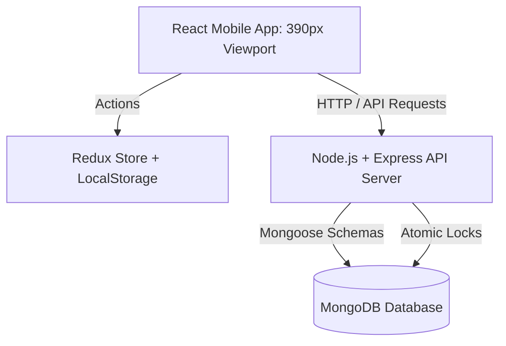

# Movie Ticket Reservation App

A premium full-stack Movie Ticket Reservation web application built with **React**, **Redux Toolkit**, **Tailwind CSS**, **Node.js**, **Express**, and **MongoDB**. 

The client interface is custom-crafted to represent a clean, minimalist mobile-oriented layout (centered viewport constrained to `390px` width) based on the Figma design specifications.

---

## 🚀 Key Features

### 🌟 Level 1 (Compulsory Core)
- **Home Carousel & Lists**: Scrollable lists categorizing movies into *"Now Showing"* and *"Coming Soon"*, along with Movie Theatres and baseline price tags.
- **Detailed Movie View**: Displays poster banners, synopses, release dates, and cast lists.
- **Date & Theatre Scheduler**: Select a booking date from a scrollable timeline, choose a cinema theatre, and pick exact screen slots and formats (2D vs 3D).
- **Programmatic Seat Matrix Grid**: Strict matrix generator matching Rows A-M and Columns 1-12 with sticky row headers. Clean state transitions:
  - **Available**: Outlined white.
  - **Occupied**: Grey solid (loaded in real-time from the backend database).
  - **Selected**: Purple solid (limited to a maximum of 6 seats per transaction).
- **Dynamic Pricing Panel**: Recalculates seat costs in real-time at the top right of the seating selector screen.
- **Booking Summary & Fee Calculator**: Final receipt breakdown calculating ticket count, subtotal, static booking fees (₹20), and payable total.
- **State Management & Persistence**: Integrated Redux Toolkit to manage selection state, which automatically persists in `localStorage` so refreshing mid-booking doesn't clear selected seats.

### ⚡ Level 2 & Bonus (Advanced Engineering)
1. **User Authentication (JWT)**: Login/Register screens. Validates details and blocks checkout until logged in. **Demo user credentials** are pre-filled on the login screen for seamless review.
2. **Simulated Payment Gateway**: Supports Card/Wallet checkout forms with custom formatting and card validations (16-digit card checks, MM/YY expiry dates, and 3-digit CVV checks).
3. **Advanced Concurrency Control**: Implements a distributed lock manager in MongoDB. A `SeatLock` collection with a compound unique index `{ scheduleId: 1, seat: 1 }` prevents race conditions. Simultaneous reservation requests for the same seat collide at the database level, preventing double booking.
4. **ACID Transaction Compliance**: Orchestrates a rollback system. If the payment gateway returns an error, the backend rollbacks, releasing any locked seat reservations immediately. The checkout page features a **Simulate Payment Failure** checkbox to demonstrate this in real time.
5. **My Bookings History & Cancellation**: A page listing active and past tickets with mock QR codes. Active bookings can be cancelled, releasing seats back to the available pool.

---

## 🛠️ Technology Stack

- **Frontend**: React, Redux Toolkit, React Router, Tailwind CSS, Lucide React (Icons).
- **Backend**: Node.js, Express, MongoDB (via Mongoose), JSON Web Tokens (JWT), BcryptJS.
- **Testing**: Fetch-based parallel async tests.

---

## 📐 Architecture & System Design



---

## 🏃 How to Run Locally

### Prerequisites
- [Node.js](https://nodejs.org/) (v18 or higher recommended)
- [MongoDB](https://www.mongodb.com/) running locally on port `27017`

### Step 1: Clone and Set Up Database
Make sure your MongoDB server is running:
```bash
mongod
```

### Step 2: Start the Backend Server
1. Navigate to the `backend/` directory.
2. Install dependencies:
   ```bash
   npm install
   ```
3. Start the dev server (it will automatically seed the database on launch):
   ```bash
   npm run dev
   ```
The backend server runs at `http://localhost:5000`.

### Step 3: Start the Frontend React Client
1. Navigate to the `frontend/` directory.
2. Install dependencies:
   ```bash
   npm install
   ```
3. Start the dev server:
   ```bash
   npm run dev
   ```
The frontend client runs at `http://localhost:5173`. Open this URL in your web browser. Enable "Mobile Device Emulation" in Developer Tools for the best experience.

---

## 🧪 Running Integration Tests

We have included automated validation scripts to test our advanced concurrency and transaction rollback features:

### Test 1: Concurrency Control (Double Booking Prevention)
Verifies that duplicate concurrent bookings for the exact same seat conflict at the database level:
```bash
# In the backend/ directory
node test-concurrency.js
```
*Expected Outcome*: One user books successfully (201 status); the other fails with a `409 Conflict` status code and a seat collision message.

### Test 2: ACID Transactions & Rollback on Failure
Verifies that payment gateway failures trigger a total seat rollback in MongoDB:
```bash
# In the backend/ directory
node test-acid.js
```
*Expected Outcome*: The checkout fails with a `400 Bad Request` status; target seats revert to 'Available' in the database, and no booking document is saved.
